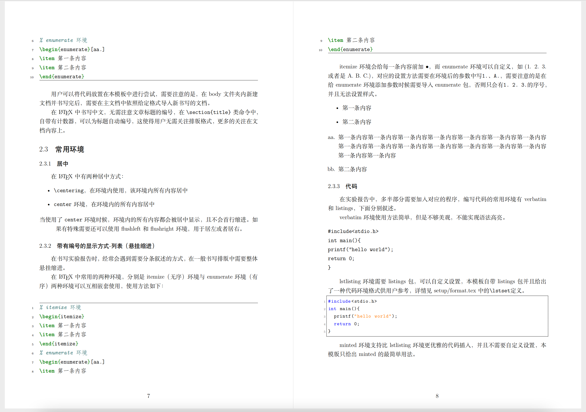

# 中山大学实验报告模版

## Quick Start
将[sysu_report_template.zip](sysu_report_template.zip)导入Overleaf，然后将Compiler修改为xelatex，重新编译就可以看到结果PDF了。具体方法见[PDF](sysu_report_template/main.pdf)中"模板使用基本知识"一节。即便是LaTeX新手，阅读生成的[PDF](sysu_report_template/main.pdf)也可以快速上手LaTeX排版。

## 致谢
在2020年第一次接触LaTeX时，作者有幸找到了成都理工学院的模版（下称：成版）。成版内容丰富，通俗易懂，极大地降低了使用LaTeX进行排版的门槛，给予了作者非常大的帮助。本模版保留了成版中的大部分内容，但增加了Overleaf和参考文献的描述，删去了过时的内容。

## 效果图

    
    
    

